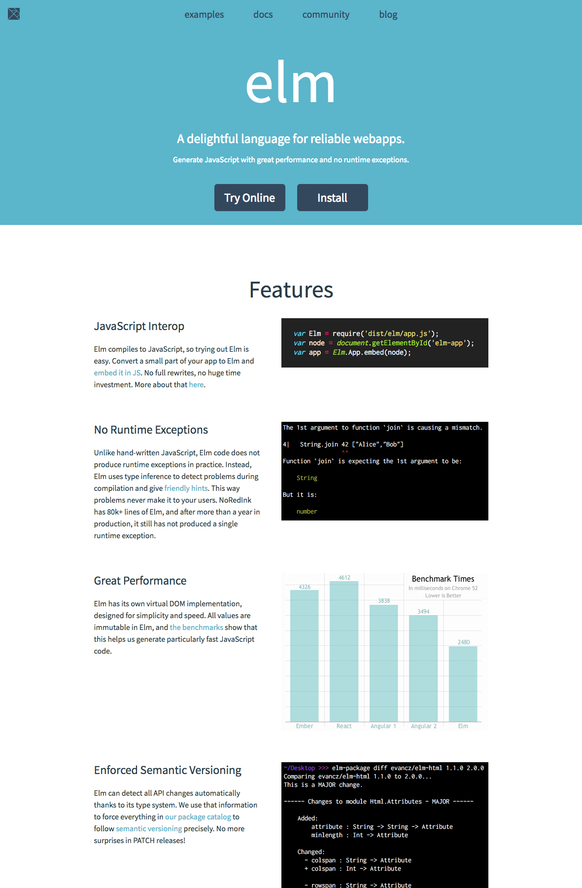

# Elmはいいぞ

[ymtszw][twitter]

@[ML DAY #1][mlday1], 2018/03/31

[mlday1]: https://ml-lang.connpass.com/event/78199/
[twitter]: https://twitter.com/gada_twt

---

## Speaker

- Yu Matsuzawa [@acecss-company][acs] ([github]/[scrapbox])
- 業務ではElixirの人。Elixirもいいぞ
- Twitter: [@gada_twt][twitter] "Gadaさん"で
- [Blizzard社][blizz]のゲーム好き。[Diabloシリーズ][d2]で育つ
- MMORPG["World of Warcraft"][wow]は今年で10年戦士

[acs]: https://www.access-company.com
[github]: https://github.com/ymtszw
[scrapbox]: https://scrapbox.io/ymtszw/
[twitter]: https://twitter.com/gada_twt
[blizz]: https://www.blizzard.com/ja-jp/
[d2]: http://us.blizzard.com/en-us/games/d2/
[wow]: https://worldofwarcraft.com/en-us/

---

## Ax Me!


---

## 今日は
# Elm
## を布教したい

---

[](http://elm-lang.org/)

---

## Elm

- **Delighful**に**reliable**なWebAppを書ける言語
- **ML-inspired syntax**
- 静的型付け、Immutable data、JavaScriptにコンパイル
- **The Elm Architecture**
- 専用のPackage Ecosystem
- 本勉強会に参加している方には名前くらいは知られてるはず
- 私の使用経験はサイドプロジェクトで約1年ほど

---

## このスライド再生アプリもElm

- 昨晩から突貫で作ったので粗いですが、追々いじるかも
- こんな形をしています

```elm
main : Program Never Model Msg
main =
    Html.program
        { init = init
        , update = update
        , subscriptions = always Sub.none
        , view = View.view
        }
```

---

```elm
type Msg
    = NoOp
    | ClientRes (Result Http.Error Success)
    | OpenFile String
    | CursorTo Int


type Success
    = GetMarkdownFile String (List String)


type alias Model =
    { index : Dict String (List String)
    , current : Maybe ( String, List String )
    , cursor : Int
    }
```

---

```elm
update : Msg -> Model -> ( Model, Cmd Msg )
update msg ({ index } as model) =
    case msg of
        NoOp ->
            ( model, Cmd.none )

        ClientRes (Ok (GetMarkdownFile filename contents)) ->
            ( { model
                | index = Dict.insert filename contents index
                , current = Just ( filename, contents )
                , cursor = 0
              }
            , Cmd.none
            )

        ...
```

---

```elm
view : Model -> Html Msg
view model =
    section [ class "section" ]
        [ div [ class "container is-fluid is-fullhd" ]
            [ div [ class "columns" ]
                [ aside [ class "menu column is-2" ]
                    [ p [ class "menu-label" ] [ text "INDEX" ]
                    , ul [ class "menu-list" ] <|
                        List.map
                            (\filename ->
                                li []
                                    [ a [ onClick (OpenFile filename) ]
                                        [ text (String.dropRight 3 filename) ]
                                    ]
                            )
                            slideList
                    ]
                , div [ class "column is-10" ] [ rendered model ]
                ]
            ]
        ]

...
```

---

## ご覧の通り…

- SyntaxはHaskellからの強い影響
    - ただし、バージョンを重ねるにつれてかなりdiverge
    - Explicitnessを重視
- [Tagged Union][adt]と[Record][record]を使って`Model`や`Msg`を定義
- HTMLタグと対応した関数で文書構造を純粋な`view`関数として記述
    - [elm-lang/virtual-dom][vdom]による高速な描画
- `update`でアプリケーション内で発火される`Msg`に対する状態遷移をexhaustiveに記述
    - `Msg`の発火は「`view`で定義したDOMから」「`update`の返り値として連鎖的に」
     「外部から`subscriptions`経由で」

[adt]: https://guide.elm-lang.org/types/union_types.html
[record]: http://elm-lang.org/docs/syntax#records
[vdom]: https://github.com/elm-lang/virtual-dom

---

## The Elm Architecture

- これが基本的な**The Elm Architecture**(TEA)
- Elmではどんなアプリも全てこのアーキテクチャのもとに開発
    - TEAでアプリケーションを開発するためのフレームワークが言語に同梱されている
- すでに多くのフォロワーが生まれている
    - 最高かどうかは分からないまでも、近頃の最大公約数的アーキテクチャ？
    - [redux](https://redux.js.org/), [hyperapp](https://github.com/hyperapp/hyperapp),
      [yew](https://github.com/DenisKolodin/yew), ...

---

## 易しい型システム、優しいコンパイラ

- ElmはHaskell/PureScriptと比較すると、型システムはかなり簡素
- **Type classはありません**
    - 何かそれに変わるシステムが用意されているわけでもないので、関数overloadもできません
    - `Maybe`や`Result`などがありますが、統一された`map`はなく、`Maybe.map`や`Result.map`を使います
- これを含め、言語機能の策定には「とにかくexplicitに、そして初学者に優しく」という方針が徹底して貫かれています
- コンパイラは充実したエラーメッセージやinstructionに溢れてます

---

## 副作用（IO）はElm任せ

- （黒魔術が存在しないわけでもないですが、）基本的にユーザが書くElmプログラムは全て純粋
- 非純粋な処理はすべてElm runtimeが非同期実行し、結果は型検査された安全な値として`Msg`にenvelopeされて`update`にrouting
    - この処理実行単位を`Cmd`と呼び、`Cmd`を構成する小単位が`Task`
- 非Elm界（≒JS界）との対話も基本的にすべてこの経路
    - ユーザ独自にJS側で処理を記述したい場合は`port`という仕組みを利用、やはり`Cmd`と`subscriptions`によるインターフェイス
    - いわゆるFFIのような仕組み（Elm関数の内部動作をJSで直接実装）は、非推奨かつ次バージョンでは禁止の見込み
- **とにかく安全！これでもかとSanitizeされた環境**で純粋なプログラミングに徹するのみ

---

## 安心感抜群のWebApp開発

- 「コンパイラに優しく導かれる」という今までにないWebApp開発ができることは請け合い
    - 公式いわく、**"zero-runtime exception"**を実現可能
    - （とはいえこれは"zero-bug"というわけではないし、コンパイラバグもちょくちょくありますが）
- **あまりに気持ちいいので、最近Elixirにも満足できなくなってきた**
- Elm開発コアチームの人のセッションに、["Make the Back-End Team Jealous: Elm in Production"][eip]というタイトルがあったけど、まさにその心境

[eip]: https://www.youtube.com/watch?v=FV0DXNB94NE

---

## 懸念点は……？

---

<blockquote class="twitter-tweet">
    <p lang="ja" dir="ltr">
        Elmは、<br>
        ・導入コスト: ゼロ (amortized;フレームワークがわかりやすいしコンパイラも親切、文法の不慣れさをも相殺する)<br>
        ・メンテコスト: ゼロ (コンパイラが不可能な変更は拒絶する。壊せないものは壊れないからメンテフリー)<br>
        ・心理コスト: ゼロ (amortized; 導入後の幸福によって相殺される)
    </p>
    &mdash; Gadagarr (@gada_twt) <a href="https://twitter.com/gada_twt/status/966219540836204544?ref_src=twsrc%5Etfw">February 21, 2018</a>
</blockquote>

---

## それは冗談にしても

- 懸念点、もちろんあります。プロダクトに使おうとする場合は十分にInformedな状態で判断しましょう
    - サイドプロジェクト・個人開発からであれば何も心配なし。というか会う人だいたい全員に薦めてる
    - 既存のアプリの一部分から使い始めることも可能だし、アプローチとしても推奨されている
- [Elmはどんな人にオススメできないか - Qiita](https://qiita.com/arowM/items/dfb38d1c5f3dfde8b8bf)
- 個人的な印象でいくつかポイントを上げるなら：
    - ボイラープレートの多い言語ではあります（Explicitness/Simplicityの裏返し）
    - 言語コア周辺から離れるにつれてコード共有（ライブラリ化）がしづらくなる傾向があります
        - そもそも新興言語でライブラリが少ない、というのも
    - バージョンアップはかなり遅いです
- このあたり、質問ありましたらぜひ

---

## Communities and elm-jp!

- Elmについて、何か困ったら：
    - [Slack](https://elmlang.herokuapp.com/)
    - [Discourse](https://discourse.elm-lang.org/)
        - 旧Google Groupの代わり。コアコミッタの人も頻繁にレスくれる
    - [/r/elm](https://www.reddit.com/r/elm/)
- 国内のコミュニティも育ってきてます！
    - Connpass: [elm_tokyo](https://elm-tokyo.connpass.com/), [elm-jp](https://elm-jp.connpass.com/)
        - 直近では[Elmハンズオン in 名古屋 - connpass](https://elm-jp.connpass.com/event/82904/)募集中
    - [Discord](https://discord.gg/AJncbK)
    - [Scrapbox](https://scrapbox.io/elm-jp/)

---

# Elm書いて気持ちよくなりましょう！


Thank You!
