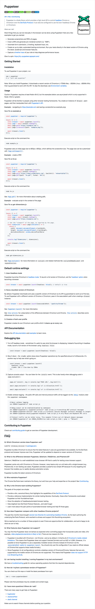
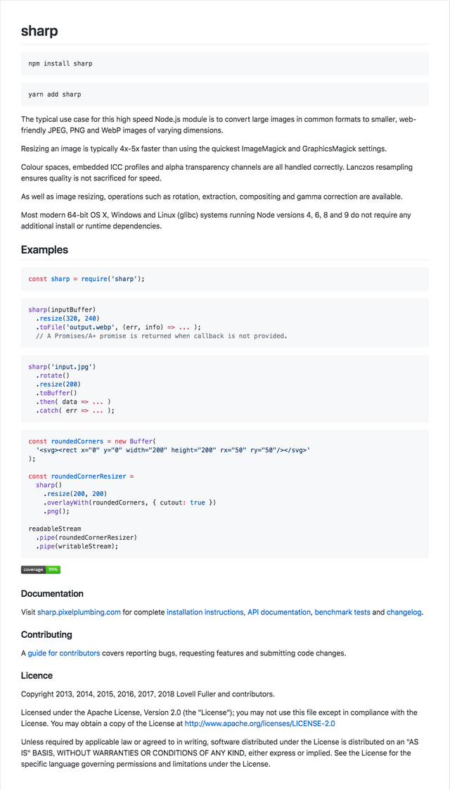

# Screenshot Crawler powered by [Puppeteer] on Heroku

[ymtszw][twitter]

[@acecss-company][acs] 社内勉強会, 2018/04/25

Slide link: https://ymtszw.github.io/elm-slides/#screenshot_crawler.md

[Puppeteer]: https://github.com/GoogleChrome/puppeteer
[twitter]: https://twitter.com/gada_twt
[acs]: https://github.com/access-company

---

## 疲れてるので今日はゆるふわ


[伏せ込み日和 ( 食べ物 ) - 百姓の田舎暮らし](https://blogs.yahoo.co.jp/wakana522000/66414466.html)

---

## [Blick]で、Google Driveのファイル以外のサムネも出したい

- URLプレビューでは良く[Open Graph Protocol (OGP)](http://ogp.me/)が使われる
- が、これはリンク先の指定した画像を使うことを余儀なくされる
    - そもそも設定されてないことも多い
    - サービスロゴでしかなかったり、リンクのリソースに対応して画像が切り替わったりはしないケースが多い
    - DescriptionとTitleだけならちゃんと設定・動的切り替えされているケースも多いが、今回出したいのはサムネ

[Blick]: https://github.com/ymtszw/blick

---

## サムネをクロールして保管しておく

- 当然こういう事を考える
- Webサービスとしてこれを機能を提供しているのがいくつかある

---

## https://www.shrinktheweb.com/


---

## https://apileap.com/


---

## サムネをクロールして保管しておく

- ほかにもあったが、どれも機能の割にそこそこなお値段
- どうやらそれなりにリソースを消費する行為の模様
    - ブラウザ相当アプリケーション(super memory hungry)を複数インスタンスで常時ぶん回しておくのだから当然か
- せっかくなので自分でやってみよう

---

## Headless Browser

- どうやら既存サービスも、中身的にはHeadless Browserを稼働させてる模様
- Headless Browserといえば最近話題の[Puppeteer]
- よーし[Puppeteer]だ

[Puppeteer]: https://github.com/GoogleChrome/puppeteer

---

## https://github.com/GoogleChrome/puppeteer



---

## Puppeteer

- 要はHeadless Chromium (設定すればChromeも使える)
- Requires at least Node v6.4.0
- APIはほとんどPromiseベースとなっており、`async/await`構文と相性が良いためNode v7.6.0以上を使うのが便利
    - GitHubのexampleもすべて`async/await`

---

## 何はともあれ完成物をデモ

- あとから見ている人は https://github.com/ymtszw/blick/tree/master/ss を参照して自分でやってみて下さい
- こうなります


---

## 仕組み

- ……もクソもない。基本的には[Puppeteer]を説明書通りに使うだけ
- コード抜粋。`async/await`初めてまともに使ったけど大変便利
    - `async`関数は`return`を勝手に`Promise`でくるむので、
      冗長な`await`を書いてるところがある気がするのだが、そのへんあまり詳しく調べていない
    - だれかPullRequest下さい

```js
const puppeteer = require('puppeteer')

const takeSS = async (browser, url) => {
  const page = await browser.newPage()
  await page.setViewport({width: 1200, height: 675}) // 16:9
  await page.setExtraHTTPHeaders({'accept-language': 'ja'})
  await page.goto(url, {waitUntil: 'networkidle2'})
  await page.waitFor(5000) // Wait for possible initial animations/effects to settle
  const buffer = await screenshotPage(page, url)
  await page.close()
  return buffer
}

const screenshotPage = async (page, url) => {
  if (url.startsWith('https://qiita.com')) {
    return await handleQiitaPage(page)
  } else if (url.includes('github.com')) {
    return await handleGitHubPage(page)
  } else {
    return await page.screenshot()
  }
}
```

[Puppeteer]: https://github.com/GoogleChrome/puppeteer

---

## 仕組み

- GitHub/GistやQiitaのページの場合のみ、ちょっとだけ以下のような工夫を入れてある

```js
const handleQiitaPage = async (page) => {
  const slideElement = await page.$('.slide')
  if (slideElement) {
    return await slideElement.screenshot()
  } else {
    const mainElement = await page.$('.p-items_article')
    if (mainElement) {
      return await mainElement.screenshot()
    } else {
      return await page.screenshot()
    }
  }
}

const handleGitHubPage = async (page) => {
  const mainTextElement = await page.$('[itemprop=text]')
  if (mainTextElement) {
    return await mainTextElement.screenshot()
  } else {
    return await page.screenshot()
  }
}
```

---

## 仕組み

- ちょっと工夫した、というかポイントとなると思っているのは
  [`Browser`](https://github.com/GoogleChrome/puppeteer/blob/master/docs/api.md#class-browser)
  インスタンス。こいつがいわばブラウザ部分の実体なので、当然起動遅いしメモリをたくさん食うはず
- 従ってこいつを複数インスタンス起動するのは避けるべきで、ひとつのインスタンスを（ちょうどタブブラウジングするように）使い回すべき

```js
const withBrowser = async (fun) => {
  const browser = await puppeteer.launch({headless: true, args: ['--no-sandbox', '--disable-setuid-sandbox']})
  process.on('error', () => browser.close())
  console.log('Browser up.')
  await fun(browser)
  return browser.close()
}
```

---

## On Heroku

- 本題
- SSを撮って回りたい巡回URLリストなんかは適当に別口で用意してAPI経由で取れるようにするだけなのでここでは割愛
- 準備ができたら「クローラ」として巡回リストを定期的に回るよう仕込む
    - あるいはリストに新規追加があった場合はオンデマンドで、あるいは高頻度で新規部分だけは早くfetchさせるとか工夫する
- いずれにせよどこかにホストさせる必要がある
- とりあえずHeroku
    - Cron的に回すだけなら簡単に設定するScheduler Addonが無料で使えるので便利
    - もちろんほかのサービスでもOK

---

## On Heroku

- `node index.js`と引数無しで起動したらクローラとして振る舞うよう実装。詳細は割愛
- Schedulerで起動させるので、dynoはweb/workerどちらもoffにしておく
- Schedulerは以下のように設定
    - まだサムネイルが付与されていないMaterialに付与するジョブ。短周期で動かす。(10分毎)
    - すでに付与されているサムネイルを更新するジョブ。`REFRESH=true`オプションを付けて長周期で動かす。（1日毎）
- [CoffeeAndCode/puppeteer-heroku-buildpack](https://github.com/CoffeeAndCode/puppeteer-heroku-buildpack)を使用
    - Chromiumが必要とする色んな依存性を持ってきてくれるbuildpack

---

## ここで問題発生

- 何も考えずに実行すると、1〜2ページ分撮影したあたりでハングアップする
    - `Page crashed!`など、あまり説明的でないエラーが出たりする
- そもそもFree Dynoは512MBメモリまでなので、最初からリソース不安はあった
- ここで、並列度制御してみようと思い立つ

---

## Node.jsとPromise

- ご存知の通りNode.jsはsingle-thread, non-blocking IO, コールバックを指定するインターフェイスでプログラミングする
    - `Promise`によってこれがもうちょっといい感じに抽象化されてわかりやすくなってる（はず）
- 複数の(`Promise`を返す)処理を並列実行し、すべての終了(あるいは最初の失敗)を待ち合わせるのは`Promise.all()`を使う

```js
const materials = await client.listMaterials()
Promise.all(materials.map(takeSS(browser)))
```

- こんな感じのことをする
- 何も考えないと、`materials`がどんだけ大量にあろうが一気に並列実行しようとする
- Renderingは大変なので当然512MBメモリなんかじゃそんなに一気にはできなくてお亡くなりになる

---

## Concurrency Control

- 既存ライブラリだと、[bluebirdの`Promise.map()`](http://bluebirdjs.com/docs/api/promise.map.html)とかを使うらしい
    - 最近はもっと他にもあるのかも。教えてプリーズ
- ここではもっとナイーブでよかったので、単に対象リストをchunkingして同時実行数を制御した
    - `Array.prototype.chunk()`とかあればいいんだけど。。。ないので自作
    - Lodashとか入れてればなんかあるはず

```js
const maxPromises = parseInt(process.env.MAX_PROMISES) || 3

const main = async () => {
  const materials = await list()
  const chunkedMaterials = chunk(materials, maxPromises, [])
  await withBrowser(async (browser) => {
    return await chunkedMaterials.reduce(chunkReducer(browser), Promise.resolve('init'))
  })
}

const chunk = (array, n, acc) => {
  acc.push(array.slice(0, n))
  const tl = array.slice(n)
  if (tl.length === 0) {
    return acc
  } else {
    return chunk(tl, n, acc)
  }
}

const chunkReducer = (browser) => async (promise, chunk, index) => {
  await promise
  console.log(`Processing chunk #${index}`)
  return Promise.all(chunk.map(ssImpl(browser)))
}
```

---

## 無事動いた。。。が

- もっと丁寧にやるなら、「同時実行数はnまで、1個resolveしたら1個新たに開始」のような制御を入れて、
  常にn個の`Promise`が回り続けるようにするのが無駄がない。が、ここでは手抜き
- 環境変数経由で同時実行数を制御できるようになったので、意気揚々とデプロイ
- 動く、動く。。。が、**なんとMAX_PROMISES=1でしか安定しなかった**。2でもぎりぎり動くが時々クラッシュする
    - Free Dynoの限界か。。。HerokuでPuppeteer使う場合は注意しましょう
    - 実はもっとリソースをうまく使う方法があって、安定させられる、といった情報も募集中

---

## 画像処理

- おまけ。撮影したSSのフォーマット変換やリサイズなどの処理は[lovell/sharp](https://github.com/lovell/sharp)を使用



---

## sharp

- こちらも`Promise`ベースAPIを提供しているので、`async/await`でサクサク書ける
- 対象要素が縦長の場合は16:9に[`crop`](http://sharp.pixelplumbing.com/en/stable/api-resize/#crop)をかけているが、
  このとき`strategy`ベースで制御できて面白い
    - `sharp.gravity` (「どのへん」を「方角」で指定する`north`, `northwest`とか)
    - `sharp.entropy` (Shannon entropyを使う)
    - `sharp.attention` (輝度ベースで判定する)
